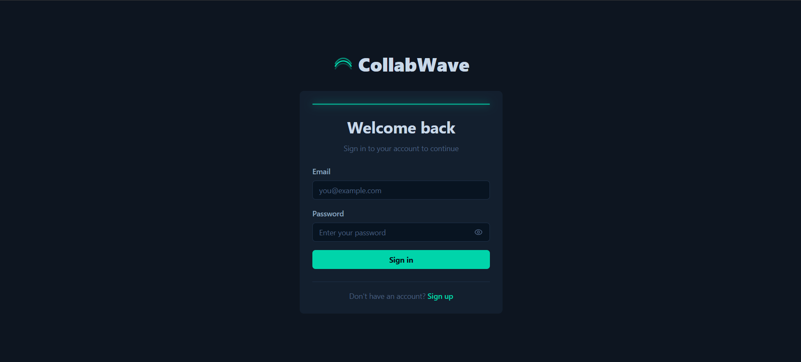
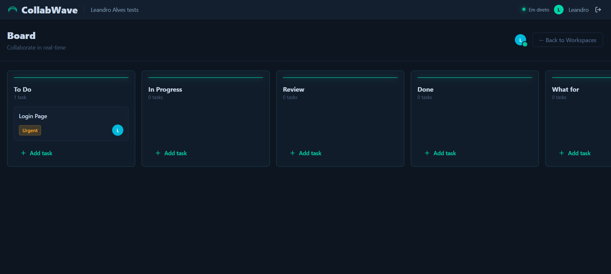

<div align="center">



**Kanban colaborativo em tempo real, multi-workspace, construído do zero com Node.js e React.**

[](https://github.com/LeandroAlves45/Collabwave/actions/workflows/ci.yml)


</div>

---

## Sobre o projeto

O **CollabWave** é uma aplicação de quadros Kanban onde várias pessoas trabalham no mesmo workspace ao mesmo tempo e veem as alterações umas das outras instantaneamente — sem refresh, sem polling. Foi construído para demonstrar como desenhar um sistema real-time de ponta a ponta: autenticação segura com rotação de tokens, sincronização de estado via Socket.IO, distribuição de eventos entre instâncias com Redis, e uma base de testes que cobre backend, frontend e fluxos end-to-end.

> [!NOTE]
> Este é um projeto de portefólio técnico. A arquitetura e as decisões de engenharia foram pensadas para escalar horizontalmente (múltiplas instâncias do backend atrás de um load balancer), mesmo estando hospedado atualmente em planos gratuitos de demonstração.

## Capturas de ecrã

<table>
  <tr>
    <td align="center" width="33%"><br /><sub>Login</sub></td>
    <td align="center" width="33%"><br /><sub>Workspaces</sub></td>
    <td align="center" width="33%"><br /><sub>Board Kanban em tempo real</sub></td>
  </tr>
</table>

## Funcionalidades

- **Autenticação segura** — registo, login, refresh com rotação de token e logout. Access token mantido apenas em memória no cliente; refresh token num cookie `HttpOnly`.
- **Workspaces partilhados** — criação de workspaces, convite por código, e gestão de membership.
- **Board Kanban em tempo real** — colunas e tarefas sincronizadas entre todos os membros via Socket.IO, com feedback imediato ao mover/criar/editar.
- **Presença online** — cada membro vê quem mais está ligado ao workspace, com distribuição de eventos entre instâncias via Redis (`@socket.io/redis-adapter`).
- **Testado a sério** — Jest e Supertest no backend, Vitest e React Testing Library no frontend, Playwright para os fluxos end-to-end.

## Stack técnica

| Camada        | Tecnologias                                                                                           |
| ------------- | ----------------------------------------------------------------------------------------------------- |
| **Frontend**  | React 19 · TypeScript · Vite 6 · Tailwind CSS v4 · Zustand · React Hook Form + Zod · socket.io-client |
| **Backend**   | Node.js 20 · Express 5 · Socket.IO 4 · TypeScript · JWT (access + refresh) · bcryptjs · Helmet        |
| **Dados**     | PostgreSQL · Knex (query builder + migrations) · Redis (ioredis)                                      |
| **Qualidade** | ESLint · Jest + Supertest · Vitest + Testing Library · Playwright · GitHub Actions                    |

## Arquitetura

```
React (Vercel) ──REST /api──▶ Express + Socket.IO (Render) ──▶ PostgreSQL (Neon)
                └────────────WebSocket─────────────┘└────▶ Redis (Render Key Value)
```

- **Frontend** publicado no Vercel, com o REST encaminhado através de `/api`.
- **API e Socket.IO** correm num Web Service do Render; o cliente liga-se diretamente via `VITE_SOCKET_URL`.
- **Redis** no Render Key Value, na mesma região da API, usado para o adapter do Socket.IO e para presença.
- **PostgreSQL** no Supabase, através do Supavisor em modo session.

> [!WARNING]
> Os planos gratuitos usados na demonstração têm limitações: o backend pode "adormecer" após inatividade, o Redis gratuito não é persistente, e o projeto Supabase gratuito pode pausar. Não representam o comportamento esperado num ambiente de produção real.

## Como correr localmente

**Requisitos:** Node.js 20+, npm 10+ e Docker.

```bash
# instalar dependências (raiz + backend + frontend)
npm ci
npm ci --prefix backend
npm ci --prefix frontend

# subir PostgreSQL e Redis em containers
docker compose up -d postgres redis

# aplicar migrations e arrancar os dois servidores em modo dev
npm run migrate --prefix backend
npm run dev --prefix backend
npm run dev --prefix frontend
```

Copia `.env.example` para `.env` e define as URLs, origens CORS e dois segredos JWT distintos (mínimo 32 caracteres cada).

## Scripts principais

```bash
npm run lint              # lint do backend e do frontend
npm run test:ci           # suites Jest + Vitest
npm run build             # build de produção de ambos os serviços
npm run test:e2e --prefix frontend   # suite Playwright
```

O backend expõe endpoints de health check usados pelo orquestrador de deploy:

- `GET /health/live`
- `GET /health/ready`

## Estrutura do repositório

```
backend/    # API Express, Socket.IO, migrations Knex e testes Jest/Supertest
frontend/   # SPA React (Vite), stores Zustand e testes Vitest/Playwright
```

Cada módulo do backend (`auth`, `workspaces`, `columns`, `tasks`) segue o padrão `controller → service → routes`, com validação própria (`*.validators.ts`) e tipos próprios (`*.types.ts`).
